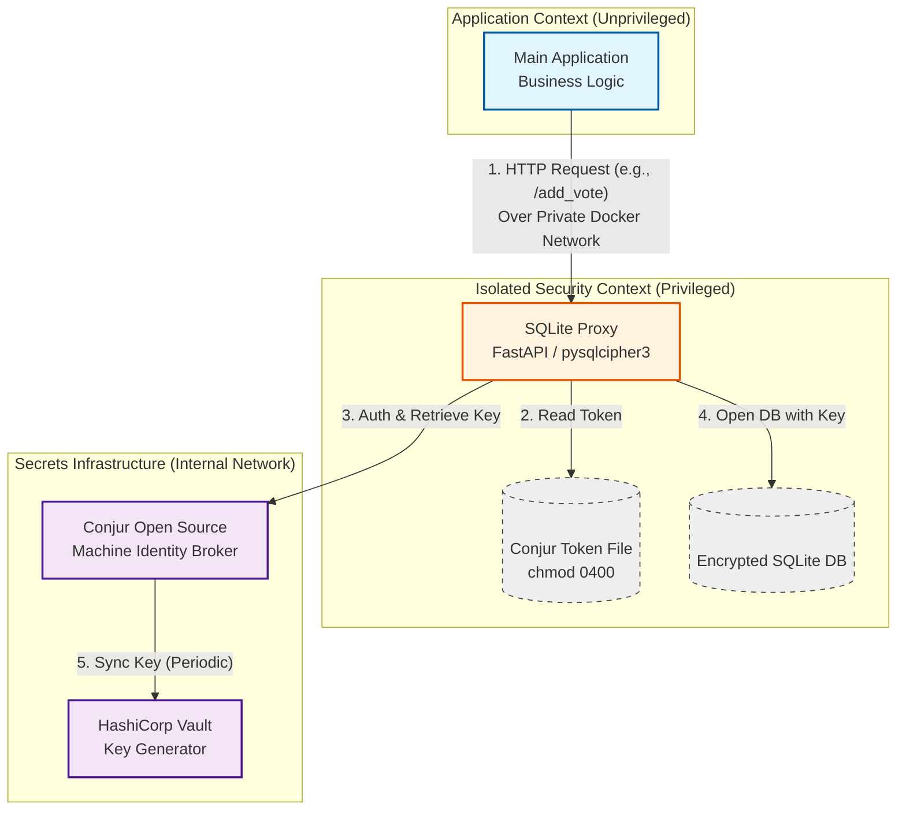

# Security Model: Memory Isolation of Database Credentials

## Problem Statement

In conventional application deployments, database credentials are loaded into the process memory, typically from environment variables, configuration files, or a secrets manager, and remain there indefinitely. This creates a significant risk: an attacker who exploits a memory read vulnerability can extract these credentials and gain persistent, unauthorized access to the database.

This exposure persists even when the application itself is well‑hardened, because the credential material is co‑located with the business logic that attackers can often influence or inspect.

## Conceptual Approach

The core defense strategy is **credential isolation**: ensure that database secrets never reside in the address space of the main application, even while the application performs database operations. This is achieved by delegating all database interactions to a separate, minimal process that runs with higher privilege and exclusive access to the secrets. The main application communicates with this intermediary over a strictly confined channel, requesting data operations without ever possessing the underlying credentials.

This pattern yields several security benefits:

- **Memory Scraping Resistance**: A memory dump of the main application yields no database secrets.
- **Reduced Attack Surface**: The component that handles secrets is small, single‑purpose, and can be subjected to intense security review, monitoring, and hardening independent of the main codebase.
- **Simplified Secret Lifecycle**: Credential rotation, access revocation, and audit logging are concentrated in one place, unaffected by changes to business logic.

## Threat Model

### What This Protects Against

- **Memory dump / memory read attacks** targeting the main application process yields nothing.
- **Exfiltration of credentials:** neither environment variables nor configuration files accessible to the main application contain any trace of the database credentials.
- **Lateral movement** that relies on credentials obtained from the application host.
- **Some application-level vulnerabilities:** since the allowed database operations are isolated within proxy endpoints, certain types of attacks on the main application, such as SQL injections, will have no effect. Still, even valid operations may be damaging if triggered via vulnerabilities.

### What This Does Not Protect Against

- **Full host compromise**: an attacker with root access or the privileges of the isolated credential handler can extract the handler’s identity material and retrieve secrets.
- **Network spoofing within the internal network**: if the handler identifies callers solely by network source, an attacker capable of impersonating the main application’s network identity can issue requests.
- **Compromise of the centralized secret stores**: the security of Vault and Conjur themselves is assumed.

## Architecture

The following diagram illustrates the concrete implementation of the isolation pattern in this proof‑of‑concept. The main application runs with no knowledge of database secrets. All database operations are forwarded to a dedicated **SQLite Proxy** over a private network. The proxy alone possesses the means to retrieve the encryption key from a secret broker and to access the encrypted database file.

### Component Responsibilities

| Component               | Role                                                                                     |
|-------------------------|------------------------------------------------------------------------------------------|
| **Main Application**    | Executes business logic. Replaces direct SQLite calls with HTTP requests to the proxy.    |
| **SQLite Proxy**        | Exclusive handler of the encrypted database. Retrieves the encryption key per request and executes operations using `pysqlcipher3`. Runs with elevated privileges to read a local token file. |
| **Conjur Open Source**  | Machine‑identity aware secret broker. Enforces policy that only the proxy may read the SQLite key. |
| **HashiCorp Vault**     | Generates and rotates the SQLite encryption key. In this PoC, runs in dev mode.           |

### Implementation Specifics (PoC)

- **Vault**: Deployed via `docker-compose.yaml` with the official `hashicorp/vault` image in dev mode. A script creates and updates the encryption key.
- **Conjur**: Deployed using `docker-compose.conjur.yaml` from the CyberArk quickstart. A synchronization script periodically fetches the key from Vault and loads it into Conjur. A policy restricts read access to the proxy's machine identity.
- **Proxy Authentication**: The proxy reads a Conjur API token from a file mounted with strict permissions (`0400`). This token is never exposed to the main application.
- **Database Encryption**: The SQLite database is encrypted using `pysqlcipher3`. For each request, the proxy retrieves the key from Conjur, opens the database with `PRAGMA key`, executes the operation, and closes the connection.
- **Network Isolation**: The proxy binds only to a private Docker network. No ports are published to the host, limiting access to containers within the same compose project.

## Limitations and Assumptions

- **Network‑Based Caller Identity**: the proxy trusts the source IP/network namespace.
- **Dev‑Mode Vault**: not suitable for production; used solely to demonstrate the flow.
- **Token File Security**: relies on filesystem isolation; an attacker who compromises the proxy container could read the token.
- **Audit Logging**: not implemented in this PoC.
